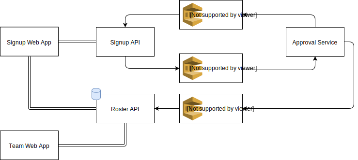

# Avengers, Assemble!

proof of concept application using AWS SQS and long polling

## Demo
using two incognito browser that don't share any local state


## Diagram


## Setup
Create the following environment files:

```
/packages/avenger-roster-api/.env

AWS_REGION=
AWS_SECRET_ACCESS_KEY=
AWS_ACCESS_KEY_ID=
AWS_ROSTER_APPLICATION_ROSTER_URL
```

```
/packages/avenger-signup-api/.env

AWS_REGION=
AWS_SECRET_ACCESS_KEY=
AWS_ACCESS_KEY_ID=
AWS_ROSTER_APPLICATION_SUBMISSIONS_URL=
AWS_ROSTER_APPLICATION_FEEDBACK_URL=
```

```
/packages/avenger-signup-web/.env.development.local

AWS_REGION=
AWS_SECRET_ACCESS_KEY=
AWS_ACCESS_KEY_ID=
AWS_ROSTER_APPLICATION_SUBMISSIONS_URL=
AWS_ROSTER_APPLICATION_FEEDBACK_URL=
```

```
/packages/signup-approval-service/.env

AWS_REGION=
AWS_SECRET_ACCESS_KEY=
AWS_ACCESS_KEY_ID=
AWS_ROSTER_APPLICATION_SUBMISSIONS_URL=
AWS_ROSTER_APPLICATION_FEEDBACK_URL
AWS_ROSTER_APPLICATION_ROSTER_URL=
```

then `npm i && npm run start` from the root
