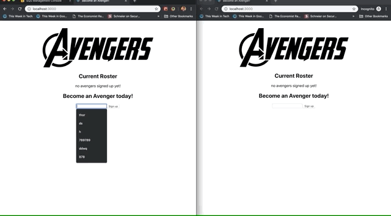

# Avengers, Assemble!

proof of concept web-app using AWS SQS and long polling.

- the approval service will return `[approval denied]` when users try to sign up using the name of a known avenger, e.g. `Thor` or `Black Widow`.
- approval messages are only sent to the browser that initiated the sign-up

- SQS default configuration, except `Default Visibility Timeout` which needs to be set to 0 seconds so that messages that enter the queue are immediately visible.

## Demo
using two browsers that don't share any local state:



## Diagram


## Setup
Create the following environment files:

```
/packages/avenger-roster-api/.env

AWS_REGION=
AWS_SECRET_ACCESS_KEY=
AWS_ACCESS_KEY_ID=
AWS_ROSTER_APPLICATION_ROSTER_URL
```

```
/packages/avenger-signup-api/.env

AWS_REGION=
AWS_SECRET_ACCESS_KEY=
AWS_ACCESS_KEY_ID=
AWS_ROSTER_APPLICATION_SUBMISSIONS_URL=
AWS_ROSTER_APPLICATION_FEEDBACK_URL=
```

```
/packages/avenger-signup-web/.env.development.local

AWS_REGION=
AWS_SECRET_ACCESS_KEY=
AWS_ACCESS_KEY_ID=
AWS_ROSTER_APPLICATION_SUBMISSIONS_URL=
AWS_ROSTER_APPLICATION_FEEDBACK_URL=
```

```
/packages/signup-approval-service/.env

AWS_REGION=
AWS_SECRET_ACCESS_KEY=
AWS_ACCESS_KEY_ID=
AWS_ROSTER_APPLICATION_SUBMISSIONS_URL=
AWS_ROSTER_APPLICATION_FEEDBACK_URL
AWS_ROSTER_APPLICATION_ROSTER_URL=
```

then `npm i && npm run start` from the root
